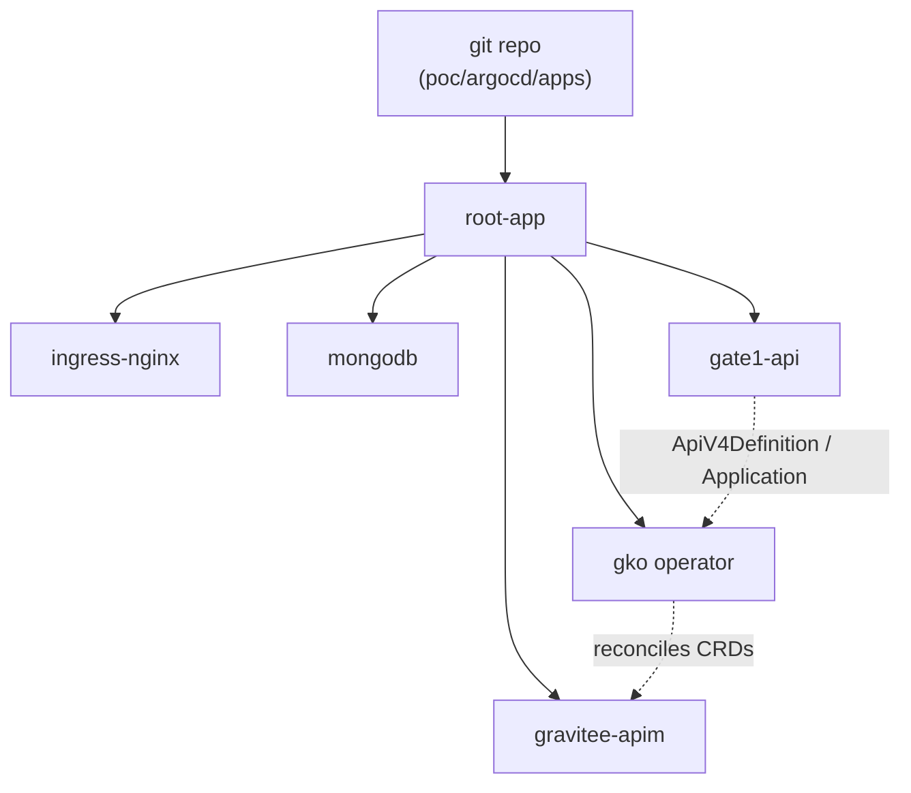
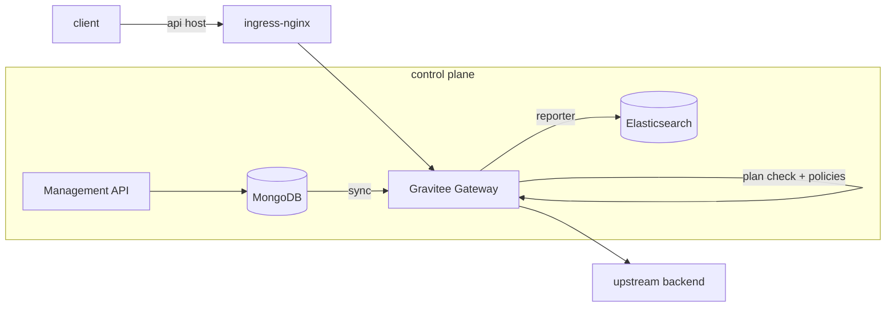

# Architecture

How the pieces fit: Gravitee's components, the GitOps control loop that runs
them, and the request flow through each gate.

## Components

Gravitee APIM is a multi-component platform, not a single binary. This PoC runs
all of it in one `gravitee` namespace, with the datastores sized for a homelab:

| Component | Role | Notes here |
| --- | --- | --- |
| Gateway | The data plane: enforces plans and policies, proxies traffic | Exposed on `gateway.gravitee.local` |
| Management API | The control plane REST API | Backs the Console and is the target the operator pushes to |
| Console UI | Admin interface for APIs, plans, policies | `console.gravitee.local/console` |
| Developer Portal | Self-service catalog and subscriptions | `console.gravitee.local` |
| MongoDB | Configuration / management repository | Standalone official `mongo:6.0` (the bundled Bitnami image was broken) |
| Elasticsearch | Analytics and logs store | Single bundled node, sized down |
| GKO | Operator that turns CRDs into Gravitee APIs | Runs in its own `gko-system` namespace |

## The GitOps control loop

Only the cluster and ArgoCD are created by hand. Everything else is an ArgoCD
`Application` reconciled from this repository, so a change is a commit and the git
history is the audit trail.

The `root-app` is the single application applied by hand; it discovers every
child application under `poc/argocd/apps` and keeps them synced. APIs are declared
as `ApiV4Definition` resources that GKO pushes into the Management API, so they
appear in the Console and Developer Portal while still living in git.

## Request flow

A client request crosses the data plane only. The control plane (Management API,
Console, Portal) configures the gateway out of band; it is not in the request
path.

At the gateway, each request is matched to an API by context path, authenticated
against the API's **plan** (keyless, API key, JWT, OAuth2, or mTLS), run through
the API's **policy flow** (for example rate limiting), and proxied to the
upstream. Analytics are reported asynchronously to Elasticsearch.

## The three gates

The PoC builds one enforcement point per gate on this same platform:

| Gate | Traffic | Edition |
| --- | --- | --- |
| **1: API** | Classic HTTP APIs: plans, rate limiting, Developer Portal | Open source |
| **2: AI / Agent** | LLM, MCP, and agent-to-agent traffic | Enterprise |
| **3: Event** | Native Kafka secured by a plan, protocol mediation | Enterprise |

Gate 1 runs entirely on the open-source edition. Gates 2 and 3 are Enterprise
features, unlocked by the trial license covered in the
[Prerequisites](prerequisites.md); applying that license is the OSS-to-Enterprise
upgrade shown at the start of Gate 2.

With the architecture in view, the build starts by
[bootstrapping the platform](bootstrap.md).
