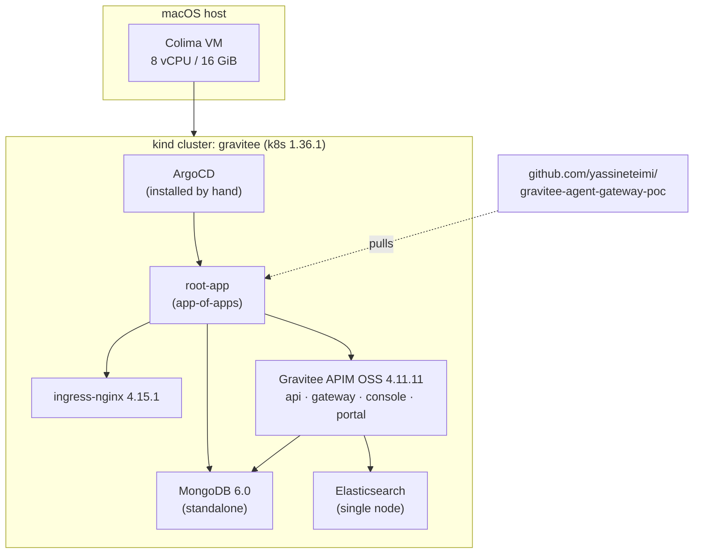

# Bootstrap (M0)

This milestone stands up the foundation every later gate builds on: a local
Kubernetes cluster, **ArgoCD** as the GitOps engine, an ingress controller, and
**Gravitee APIM** itself, deployed from a pinned Helm chart and reconciled from
this public repository.

Two deliberate choices shape the milestone:

- **Open source first, no license.** We start on the OSS edition with no
  Enterprise license. The OSS edition is the API gateway core; the AI and Kafka
  gates are Enterprise features unlocked later. Starting OSS lets a reader follow
  the whole bootstrap with nothing to buy, and it lets us document the
  **OSS to Enterprise upgrade** as its own deliberate step rather than hiding it.
- **GitOps from the second component on.** Only the cluster and ArgoCD itself are
  created by hand. Everything after that, the ingress controller, the datastores,
  and Gravitee, is an ArgoCD `Application` pulled from git. A change is a commit,
  not a `kubectl` run, and the git history is the audit trail.

## What you need

The build was done on macOS (Apple Silicon) with a Colima VM hosting the
Docker runtime. Versions are pinned and recorded so the milestone is
reproducible:

| Tool | Version | Role |
| --- | --- | --- |
| Colima | 0.10.3 | Local VM + Docker runtime |
| kind | 0.32.0 | Kubernetes in Docker |
| kubectl | 1.31.2 | Cluster CLI |
| Helm | 4.2.2 | Chart tooling (ArgoCD renders charts itself) |
| ArgoCD | 3.4.3 | GitOps engine (client and server pinned together) |
| Gravitee APIM chart | 4.11.11 | `graviteeio/apim`, app version 4.11.11 |
| ingress-nginx chart | 4.15.1 | Ingress controller |

Gravitee's footprint is heavier than a typical gateway: a Management API, a
Console UI, a Developer Portal, the Gateway itself, plus a MongoDB
configuration store and an Elasticsearch analytics store. The VM is sized
accordingly.

## The shape of the bootstrap



ArgoCD watches the repository. The single `root-app` applied by hand discovers
every child `Application` under `poc/argocd/apps/` and reconciles it.

## Step 1: size the VM

Gravitee plus its datastores will not fit in a default 8 GiB VM. Restart Colima
with more headroom. The host here has 36 GiB and 12 cores, so 16 GiB leaves the
desktop comfortable.

```{ .sh .terminal }
$ colima stop
$ colima start --cpu 8 --memory 16 --disk 60
$ colima list
```

```text title="Expected output"
PROFILE    STATUS     ARCH       CPUS    MEMORY    DISK     RUNTIME    ADDRESS
default    Running    aarch64    8       16GiB     60GiB    docker
```

## Step 2: create the cluster

A single control-plane node is plenty for a homelab. Host ports 80 and 443 are
mapped into the node so the ingress controller can serve browser traffic, and
the node is labelled `ingress-ready` so the controller schedules onto it.

```yaml title="poc/cluster/kind-config.yaml"
kind: Cluster
apiVersion: kind.x-k8s.io/v1alpha4
name: gravitee
nodes:
  - role: control-plane
    image: kindest/node:v1.36.1
    kubeadmConfigPatches:
      - |
        kind: InitConfiguration
        nodeRegistration:
          kubeletExtraArgs:
            node-labels: "ingress-ready=true"
    extraPortMappings:
      - containerPort: 80
        hostPort: 80
        protocol: TCP
      - containerPort: 443
        hostPort: 443
        protocol: TCP
```

```{ .sh .terminal }
$ kind create cluster --config poc/cluster/kind-config.yaml
$ kubectl wait --for=condition=Ready node --all --timeout=120s
```

```text title="Expected output"
Set kubectl context to "kind-gravitee"
node/gravitee-control-plane condition met
```

## Step 3: install ArgoCD

ArgoCD is the one component installed imperatively. It is the chicken before the
GitOps egg, so it cannot deploy itself. Pin it to the same version as the client.

```{ .sh .terminal }
$ kubectl create namespace argocd
$ kubectl apply -n argocd -f https://raw.githubusercontent.com/argoproj/argo-cd/v3.4.3/manifests/install.yaml
```

!!! warning "Finding: the ApplicationSet CRD is too big for client-side apply"
    The plain apply fails on one resource:

    ```text
    The CustomResourceDefinition "applicationsets.argoproj.io" is invalid:
    metadata.annotations: Too long: may not be more than 262144 bytes
    ```

    `kubectl apply` stores the whole manifest in a `last-applied` annotation, and
    the ApplicationSet CRD exceeds the 262 KB annotation limit. The fix is
    server-side apply, which keeps no such annotation:

    ```{ .sh .terminal }
    $ kubectl apply --server-side --force-conflicts -n argocd \
        -f https://raw.githubusercontent.com/argoproj/argo-cd/v3.4.3/manifests/install.yaml
    ```

Wait for the server, then confirm the pods:

```{ .sh .terminal }
$ kubectl rollout status deploy/argocd-server -n argocd --timeout=180s
$ kubectl get pods -n argocd
```

```text title="Expected output"
deployment "argocd-server" successfully rolled out
NAME                                                READY   STATUS    RESTARTS   AGE
argocd-application-controller-0                     1/1     Running   0          ...
argocd-applicationset-controller-...               1/1     Running   0          ...
argocd-dex-server-...                              1/1     Running   0          ...
argocd-notifications-controller-...                1/1     Running   0          ...
argocd-redis-...                                   1/1     Running   0          ...
argocd-repo-server-...                             1/1     Running   0          ...
argocd-server-...                                  1/1     Running   0          ...
```

## Step 4: the app-of-apps

From here on, the cluster is driven from git. One `root-app` is applied by hand;
it recurses through `poc/argocd/apps/` and reconciles every child `Application`.

```yaml title="poc/argocd/root-app.yaml"
apiVersion: argoproj.io/v1alpha1
kind: Application
metadata:
  name: root-app
  namespace: argocd
spec:
  project: default
  source:
    repoURL: https://github.com/yassineteimi/gravitee-agent-gateway-poc
    targetRevision: main
    path: poc/argocd/apps
    directory:
      recurse: true
  destination:
    server: https://kubernetes.default.svc
    namespace: argocd
  syncPolicy:
    automated:
      prune: true
      selfHeal: true
    syncOptions:
      - CreateNamespace=true
```

The ingress controller is a child app, configured the kind way: the controller
binds host ports 80 and 443 on the node so traffic to the cluster reaches it.

```yaml title="poc/argocd/apps/ingress-nginx.yaml (helm values)"
controller:
  hostPort:
    enabled: true
  service:
    type: ClusterIP
  nodeSelector:
    ingress-ready: "true"
  tolerations:
    - key: node-role.kubernetes.io/control-plane
      operator: Equal
      effect: NoSchedule
  publishService:
    enabled: false
  watchIngressWithoutClass: true
```

Gravitee itself is a **multi-source** `Application`: the chart comes from the
Gravitee Helm repo, while the values overlay is read from this git repo, so the
runtime configuration stays version-controlled next to the docs.

```yaml title="poc/argocd/apps/gravitee-apim.yaml"
spec:
  sources:
    - repoURL: https://helm.gravitee.io
      chart: apim
      targetRevision: 4.11.11
      helm:
        valueFiles:
          - $values/poc/helm/gravitee-values.yaml
    - repoURL: https://github.com/yassineteimi/gravitee-agent-gateway-poc
      targetRevision: main
      ref: values
  destination:
    namespace: gravitee
  syncPolicy:
    automated: { prune: true, selfHeal: true }
    syncOptions:
      - CreateNamespace=true
      - ServerSideApply=true
```

Apply the root app once. ArgoCD does the rest.

```{ .sh .terminal }
$ kubectl apply -f poc/argocd/root-app.yaml
$ kubectl get applications -n argocd
```

## Step 5: sizing Gravitee for a homelab

The chart defaults assume a production cluster. Two overrides keep it inside a
16 GiB VM. The first collapses Elasticsearch from a six-pod cluster to a single
node by letting the master node also serve the data and ingest roles:

```yaml title="poc/helm/gravitee-values.yaml (excerpt)"
elasticsearch:
  enabled: true
  master:
    masterOnly: false
    replicaCount: 1
  data:
    replicaCount: 0
  coordinating:
    replicaCount: 0
  ingest:
    replicaCount: 0

es:
  endpoints:
    - http://graviteeio-apim-elasticsearch-master-hl:9200
  settings:
    number_of_shards: 1
    number_of_replicas: 0
```

The second splits ingress hosts so the Gateway's `/` route does not collide with
the Developer Portal's `/` route: the control plane (Console, Portal, Management
API) is served on `console.gravitee.local`, and the data-plane Gateway on
`gateway.gravitee.local`.

## Findings: the Bitnami legacy-image saga

The bundled MongoDB and Elasticsearch subcharts cost the most debugging time,
and all of it traces to one event: in 2025 Bitnami moved its free container
images to a `bitnamilegacy` repository and deleted some old tags. Three failures
followed, in order. They are worth recording because anyone installing this
chart today will hit them.

**1. The chart refuses the legacy images.** The first sync fails to render:

```text
ERROR: Original containers have been substituted for unrecognized ones.
Unrecognized images:
  - docker.io/bitnamilegacy/mongodb:6.0.13
... set the global parameter 'global.security.allowInsecureImages' to true.
```

The subcharts now guard against non-standard images. For a homelab that is
acceptable, so we opt in:

```yaml title="poc/helm/gravitee-values.yaml (excerpt)"
global:
  security:
    allowInsecureImages: true
```

**2. The init containers still point at a deleted image.** Next, Elasticsearch
and MongoDB will not start: their `sysctl` and `volume-permissions` init
containers default to `bitnami/os-shell`, which no longer exists.

```text
Failed to pull image "docker.io/bitnami/os-shell:12-debian-12-r48":
... docker.io/bitnami/os-shell:12-debian-12-r48: not found
```

Repoint those init images at the legacy repo, and enable the volume-permissions
init so the data directories get chowned for the non-root user:

```yaml title="poc/helm/gravitee-values.yaml (excerpt)"
elasticsearch:
  sysctlImage:
    repository: bitnamilegacy/os-shell
  volumePermissions:
    enabled: true
    image:
      repository: bitnamilegacy/os-shell
```

Elasticsearch recovers and goes to `1/1`.

**3. The legacy MongoDB image is broken beyond a values fix.** MongoDB keeps
crash-looping even after the init containers are fixed:

```text
realpath: /bitnami/mongodb/data/db: No such file or directory
cp: cannot open '/opt/bitnami/mongodb/conf.default/./mongodb.conf' for reading: Permission denied
```

The container runs with `readOnlyRootFilesystem: true` and `runAsUser: 1001`, and
the `bitnamilegacy/mongodb:6.0.13` re-tag ships its own `/opt/bitnami` config
files unreadable by uid 1001. No Helm value fixes a baked-in image permission.

Rather than fight the vendor's broken image, the bundled MongoDB is **disabled**
and replaced with a standalone official `mongo:6.0`, deployed as its own ArgoCD
app and pointed at by Gravitee:

```yaml title="poc/helm/gravitee-values.yaml (excerpt)"
mongodb:
  enabled: false

mongo:
  uri: mongodb://mongodb:27017/gravitee
  rsEnabled: false
```

```yaml title="poc/datastores/mongodb/mongodb.yaml (excerpt)"
containers:
  - name: mongodb
    image: mongo:6.0
    args: ["--bind_ip_all"]
    ports:
      - containerPort: 27017
```

ArgoCD prunes the old StatefulSet automatically, the standalone Mongo comes up,
and the Gravitee Management API connects to it on the next restart.

!!! note "Why keep Elasticsearch bundled but replace MongoDB"
    Elasticsearch recovered cleanly once the deleted init image was repointed, so
    the bundled subchart was kept. MongoDB had a deeper, image-level permission
    break that no configuration resolves, so it was replaced. Use the bundled
    component when it works; swap it when it does not.

## Verify

Every ArgoCD application should be `Synced` and `Healthy`:

```{ .sh .terminal }
$ kubectl get applications -n argocd
```

```text title="Expected output"
NAME            SYNC STATUS   HEALTH STATUS
gravitee-apim   Synced        Healthy
ingress-nginx   Synced        Healthy
mongodb         Synced        Healthy
root-app        Synced        Healthy
```

Every pod in the `gravitee` namespace should be ready:

```{ .sh .terminal }
$ kubectl get pods -n gravitee
```

```text title="Expected output"
NAME                                       READY   STATUS    RESTARTS   AGE
gravitee-apim-api-...                      1/1     Running   0          ...
gravitee-apim-gateway-...                  1/1     Running   0          ...
gravitee-apim-portal-...                   1/1     Running   0          ...
gravitee-apim-ui-...                       1/1     Running   0          ...
graviteeio-apim-elasticsearch-master-0     1/1     Running   0          ...
mongodb-...                                1/1     Running   0          ...
```

Map the two hostnames to the loopback address so a browser (and `curl`) can
reach the ingress:

```{ .sh .terminal }
$ echo "127.0.0.1 console.gravitee.local gateway.gravitee.local" | sudo tee -a /etc/hosts
```

Then confirm traffic flows through the ingress:

```{ .sh .terminal }
$ curl -s -o /dev/null -w "%{http_code}\n" http://console.gravitee.local/console/
$ curl -s -o /dev/null -w "%{http_code}\n" http://console.gravitee.local/management/v2/ui/bootstrap
$ curl -s http://gateway.gravitee.local/
```

```text title="Expected output"
200
200
No context-path matches the request URI.
```

The Gateway returning a 404 with that message is the **correct** healthy
response: the gateway is answering, there are simply no published APIs yet. That
is the job of the next milestone.

Open the Console at
[http://console.gravitee.local/console/](http://console.gravitee.local/console/)
and log in with the default `admin` / `admin`. To watch the GitOps state, port
forward ArgoCD:

```{ .sh .terminal }
$ kubectl port-forward -n argocd svc/argocd-server 8080:443
```

The admin password is read once from a generated secret:

```{ .sh .terminal }
$ kubectl -n argocd get secret argocd-initial-admin-secret \
    -o jsonpath='{.data.password}' | base64 -d; echo
```

## Where this leaves us

The triple-gate foundation is live and reconciled from git: a healthy Gravitee
OSS control plane and gateway, on right-sized datastores, with ArgoCD as the
single source of truth. No Enterprise license is involved yet, by design.

Next, **[Gate 1](gates/api-gateway.md)** publishes a real API on the gateway,
puts a Plan and rate limiting in front of it, and exposes it through the
Developer Portal, all as reviewed commits.
