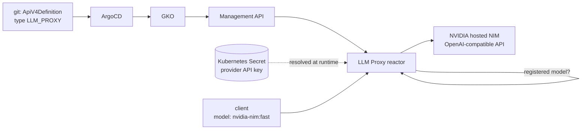

# Gate 2: AI / Agent Gateway

The second gate puts the same kind of control in front of **LLM traffic** that
Gate 1 put in front of a REST API: a declared catalogue of what callers may ask
for, a credential the caller never sees, and accounting on what each call costs.
Gravitee treats this as a first-class API type rather than a proxy with policies
bolted on, so the whole thing is still an `ApiV4Definition` reconciled by the
operator from git.

This chapter covers the **LLM Proxy** to a hosted model provider. The MCP server
and agent-to-agent sections follow as they are built.



## What Enterprise actually turns on

The AI and Kafka gates are Enterprise features, so this milestone is also the
OSS to EE upgrade. The first surprise is that there is nothing to re-install:

!!! success "The OSS image is the EE image"
    `graviteeio/apim-gateway` already ships every Enterprise plugin, 141 of them
    in this build, including `llm-proxy`, `mcp-proxy`, `a2a-proxy`, the
    `ai-prompt-guard-rails` and `ai-prompt-token-tracking` policies and the whole
    `kafka-*` family. The license does not deliver code, it unlocks at runtime
    what is already on disk. An OSS to EE upgrade is therefore one file and a
    rollout restart, and the reactors announce themselves in the gateway log:

    ```text title="Gateway log after the license is mounted"
    > llm-proxy-reactor [3.3.9] has been loaded
    > mcp-proxy-reactor [3.1.6] has been loaded
    > a2a-proxy-reactor [2.1.1] has been loaded
    > native-kafka-reactor [7.1.0] has been loaded
    ```

Mounting that file takes a detour. The chart creates and mounts its license
Secret only when `license.key` is set **in the values file**, and that value is
the signed key itself, so the documented path means committing the license to
git. The PoC keeps it out by creating the Secret from a gitignored key file and
mounting it through the components' `extraVolumes`:

```yaml title="poc/helm/gravitee-values.yaml (excerpt)"
gateway:
  extraVolumes: |
    - name: licensekey
      secret:
        secretName: gravitee-license
        optional: true          # a license-free install still starts
        items:
          - key: licensekey
            path: license.key
  extraVolumeMounts: |
    - name: licensekey
      mountPath: /opt/graviteeio-gateway/license
      readOnly: true
```

!!! warning "The license file is binary, not the base64 you are given"
    Gravitee reads `license.key` as a binary license3j file, while what you are
    handed (and what the chart's `license.key` value expects) is that file
    rendered as base64 text. Feeding the text straight in fails at startup with
    `IllegalArgumentException: serialized license is corrupt`, which says nothing
    about encoding. `poc/scripts/inject-secrets.sh` detects base64 text and
    decodes it before creating the Secret.

Verification is a single call, and unlike the startup log (which prints the
licensee's company and contact email) this endpoint returns nothing identifying:

```{ .sh .terminal }
$ curl -s -u admin:admin \
    http://console.gravitee.local/management/v2/organizations/DEFAULT/license \
    | python3 -c 'import sys,json; d=json.load(sys.stdin); print(d["tier"], len(d["packs"]), "packs", len(d["features"]), "features")'
```

```text title="Expected output"
universe 13 packs 112 features
```

## The version that could not run an LLM Proxy

The first LLM Proxy API declared on APIM **4.11.11** never reached the gateway.
Deploying it threw a class-loading error and, worse, killed the thread that
deploys APIs, so from that moment the gateway silently stopped picking up **any**
API change until it was restarted:

```text title="Gateway log, APIM 4.11.11"
Exception in thread "gio.sync-deployer-0" java.lang.IncompatibleClassChangeError:
class com.networknt.schema.resource.DefaultSchemaLoader can not implement
com.networknt.schema.resource.SchemaLoader, because it is not an interface
```

The cause is a dependency skew inside the distribution itself. The gateway image
carries one version of the networknt JSON schema validator on the parent
classpath, and the bundled LLM Proxy entrypoint plugin carries an older one of
its own. Parent-first loading mixes the two, and the type changed shape between
them:

| Jar | `SchemaLoader` | `DefaultSchemaLoader` |
| --- | --- | --- |
| `json-schema-validator-1.5.9` (inside `entrypoint-llm-proxy 2.10.3`) | interface | present |
| `json-schema-validator-2.0.0` (image `lib/ext`, parent loader) | class | absent |

The plugin's `DefaultSchemaLoader` declares `implements SchemaLoader`, resolves
`SchemaLoader` from the parent as a class, and the JVM refuses. Comparing the
published images shows it fixed on both maintained lines, so the answer is to
move up rather than to patch a classpath:

| APIM | entrypoint-llm-proxy | networknt it bundles | Result |
| --- | --- | --- | --- |
| 4.11.11 | 2.10.3 | 1.5.9 | broken |
| 4.11.27 | 2.11.3 | 2.0.0 | aligned |
| 4.12.19 | 3.3.9 | none, uses the parent | aligned |

This lab moved to **4.12.19** for APIM and the operator together, which is a
one-line change per ArgoCD application. Gate 1 kept working across the upgrade
with no manifest changes.

!!! note "The operator's CRDs were not under GitOps"
    The GKO Helm chart ships no CRDs at all, in neither `crds/` nor `templates/`.
    Milestone 1 applied them by hand, so the cluster quietly kept running the
    CRD bundle of an older operator while every other piece was declared. The
    upgrade was the moment to fix it: the official
    `custom-resource-definitions.zip` from the matching release tag is now
    vendored in `poc/gko/crds/` and listed as Kustomize `resources`, so a CRD
    change is a reviewable diff like everything else. The Gateway API CRDs that
    ship in the same bundle are deliberately left out, since they are cluster
    scoped and not this PoC's to own.

## Declaring the LLM Proxy

`LLM_PROXY` is one of the v4 API types, alongside `PROXY`, `MESSAGE`, `NATIVE`,
`MCP_PROXY` and `A2A_PROXY`. It has its own reactor, so the gateway parses the
OpenAI-shaped payload, knows which model was requested and counts the tokens that
come back. The backend here is NVIDIA's hosted NIM, which speaks the OpenAI API,
hence the `OPEN_AI_COMPATIBLE` provider:

```yaml title="poc/gate2-ai/llm-proxy-api.yaml (excerpt)"
spec:
  type: LLM_PROXY
  listeners:
    - type: HTTP
      paths:
        - path: "/llm"
      entrypoints:
        - type: llm-proxy
          configuration:
            enforceUsage: true        # count tokens even when streaming
            injectTokenHeaders: true  # report the count back to the caller
  endpointGroups:
    - name: default-group
      type: llm-proxy
      endpoints:
        - name: nvidia-nim
          type: llm-proxy
          inheritConfiguration: true
          secondary: false
          configuration:
            provider: OPEN_AI_COMPATIBLE
            target: https://integrate.api.nvidia.com/v1
            authentication:
              type: BEARER
              bearer: "{#secrets.get('/kubernetes/nvidia-nim-credentials:apiKey')}"
            models:
              - name: nvidia/nemotron-3.5-lightning-30b-a3b
                aliases: [fast]
              - name: nvidia/nemotron-3-super-120b-a12b
                aliases: [smart]
              - name: z-ai/glm-5.3-flash
                aliases: [flash]
            modelGovernance:
              aliasOnly: false
              modelPattern: ""        # empty: registered models only
```

Two things in that block are the actual governance. The **model catalogue** is a
closed list: a request for anything not in it is refused by the gateway and never
forwarded, which is what stops a caller reaching for a model nobody approved or
budgeted. **Aliases** decouple the name a client sends from the model actually
called, so swapping the model behind `fast` is a commit here rather than a change
in every client.

!!! warning "Model names must carry the endpoint name as a prefix"
    `modelGovernance.prefixPolicy.policy` defaults to `PREFIXED_BOTH`, so clients
    ask for `nvidia-nim:fast`, not `fast`. That is also why the schema forbids
    `:` inside an alias. An unprefixed name is rejected exactly like an unknown
    one, with an OpenAI-shaped `model_not_found`, which reads like a provider
    error while it is in fact the gateway refusing. The policy can be relaxed to
    `PREFIXED_ALIAS`, `PREFIXED_MODEL` or `NO_PREFIX`.

!!! tip "Check the provider catalogue before trusting it"
    NVIDIA's `/v1/models` listing is not what an account can actually call. Every
    Llama model in it is end-of-life and answers `410 Gone`, and several others
    return `404 Function ... Not found for account`. Probe a model with a real
    completion before putting it in a gateway catalogue.

## Keeping the provider key out of git

The API definition lives in a public repository, so the NVIDIA key is referenced,
not written. The gateway resolves it at runtime from a Kubernetes Secret created
by `poc/scripts/inject-secrets.sh` from the gitignored `.env`. Getting there took
three wrong turns, and every one of them failed quietly:

| What was written | What happened |
| --- | --- |
| `secret://kubernetes/name:apiKey` | Passed through as a literal string and **sent to the provider as the token**. NVIDIA answered 401. |
| `{#secrets.get('secret://kubernetes/name:apiKey')}` | `GrantService: no spec found for ref`, the expression resolved to an empty string, and the gateway called the provider **with no Authorization header at all**. |
| Provider declared only under the top-level `secrets:` block | The plugin loaded but no provider was deployed for APIs. The request **hung forever**, blocking a Vert.x event loop with `VertxException: Thread blocked`. |

The two rules behind those failures are worth stating plainly. First, inside an
API definition a secret is referenced with the **expression language form and a
path**, because the secret service discovers references by scanning the
definition for the literal `{#secrets.get(`; a bare URI is just text to it.
Second, secrets used by API definitions need their providers declared in a
**different scope** from the top-level `secrets:` block, which only resolves
secrets inside `gravitee.yml` itself:

```yaml title="poc/helm/gravitee-values.yaml (excerpt)"
gateway:
  api:
    secrets:
      allowGeneratedSpecs: true   # derive the secret spec from the reference
      providers:
        - id: kubernetes
          plugin: kubernetes
          configuration:
            enabled: true
            namespace: gravitee
```

```text title="Gateway log, provider correctly declared"
Deploying secret provider [kubernetes] of type [kubernetes] for environment [*]...
Secret provider [kubernetes] of type [kubernetes] for environment [*]: DEPLOYED
```

No extra RBAC is needed: the chart already grants the components' ServiceAccount
`get`, `list` and `watch` on Secrets in the namespace.

## Timeouts have to be sized for inference

A REST backend answers in milliseconds; a language model does not. The fastest
model in this catalogue takes about eleven seconds and the reasoning one over two
minutes, and **three independent layers** will each cut the call at their own
default and return their own 504:

| Layer | Default | How to recognise its 504 |
| --- | --- | --- |
| Endpoint `sharedConfiguration.http.readTimeout` | 10s | Gravitee headers present, log says `NoStackTraceTimeoutException ... 10000ms` |
| Gateway `http.requestTimeout` | 30s | Body is `{"message":"Request timeout","http_status_code":504}` |
| nginx ingress `proxy-read-timeout` | 60s | **No** `X-Gravitee-*` headers on the response |

Chasing this one layer at a time is a waste of an afternoon, so all three are
raised together: 170s on the endpoint, 180s on the gateway and 180s on the
ingress, keeping the endpoint just under the platform so a slow provider surfaces
as an endpoint error instead of the platform cutting first.

!!! note "Group-level shared configuration needs inheritance turned on"
    Timeouts sit in the endpoint group's `sharedConfiguration`, which an endpoint
    only picks up when `inheritConfiguration: true`. Gate 1 sets it to `false`,
    so this is one of the rare places the two gates differ. The CRD also exposes
    a group-level `http:` field, but the operator's validating webhook rejects
    it. When a change is applied and ArgoCD keeps reporting the new revision as
    `OutOfSync`, check the webhook: it can panic on a nil pointer, which leaves
    the resource silently at its previous content. `kubectl apply
    --dry-run=server` tests a manifest shape against the webhook without touching
    the cluster.

## What the gateway enforces

End to end, on the live lab. A registered alias passes and comes back with the
token count and the model that actually served it:

```{ .sh .terminal }
$ curl -s -D - -o /tmp/llm.json \
    --resolve gateway.gravitee.local:80:127.0.0.1 \
    http://gateway.gravitee.local/llm/chat/completions \
    -H 'Content-Type: application/json' \
    -d '{"model":"nvidia-nim:fast","messages":[{"role":"user","content":"In one short sentence, what is an API gateway?"}],"max_tokens":60}' \
    | grep -iE 'HTTP/|X-LLM-Proxy'
```

```text title="Expected output"
HTTP/1.1 200 OK
X-LLM-Proxy-Tokens-Sent: 27
X-LLM-Proxy-Tokens-Received: 60
X-LLM-Proxy-Model: nvidia/nemotron-3.5-lightning-30b-a3b
```

Those headers are the foundation the token rate limit and the cost controls build
on: the gateway is counting, not just forwarding. Note that the entrypoint emits
`X-LLM-Proxy-Tokens-*`, while the plugin's own configuration schema describes
them as `X-Token-Usage-*`.

Running the whole matrix shows both halves of the gate, routing and refusal:

```text title="Every model the catalogue accepts, and two it does not"
nvidia-nim:fast     200   nvidia/nemotron-3.5-lightning-30b-a3b    11s
nvidia-nim:smart    200   nvidia/nemotron-3-super-120b-a12b         1s
nvidia-nim:flash    200   z-ai/glm-5.3-flash                      165s
nvidia-nim:gpt-4o   400   unregistered model, refused by the gateway
fast                400   unprefixed name, refused by the gateway
```

The two rejections never leave the cluster. That is the difference between a
gateway and a reverse proxy in front of an LLM: the model catalogue is policy,
enforced before a single token is spent.

## Where Gate 2 stands

The LLM Proxy is live, declared from git, with the provider credential resolved
at runtime and token accounting on every response. Still to come in this gate,
each built the same declarative way:

- a **plan** on the LLM API, so the caller authenticates as in Gate 1,
- **prompt guardrails** and a **token rate limit**, the policies the token
  headers above make possible,
- an API exposed as an **MCP server** with method-level access control,
- **agent-to-agent** governance.
