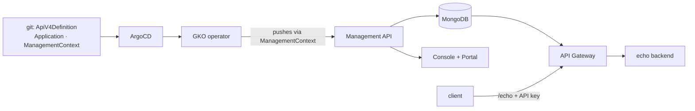
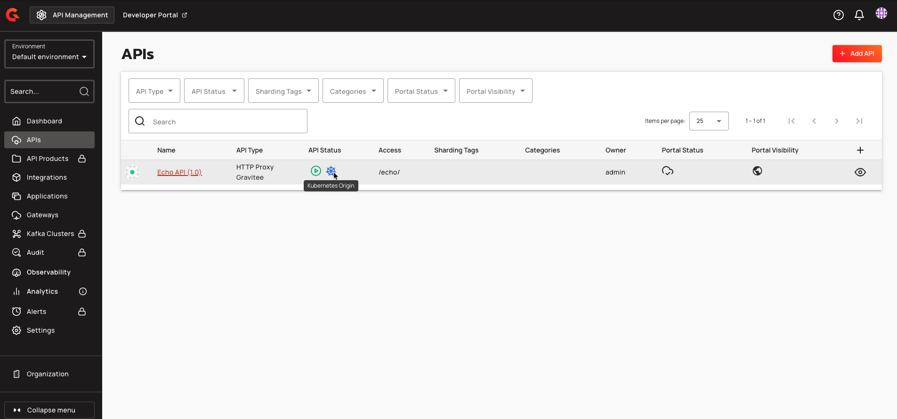
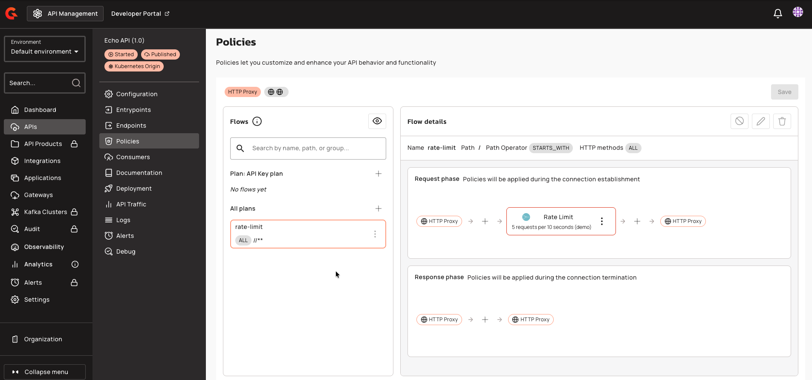
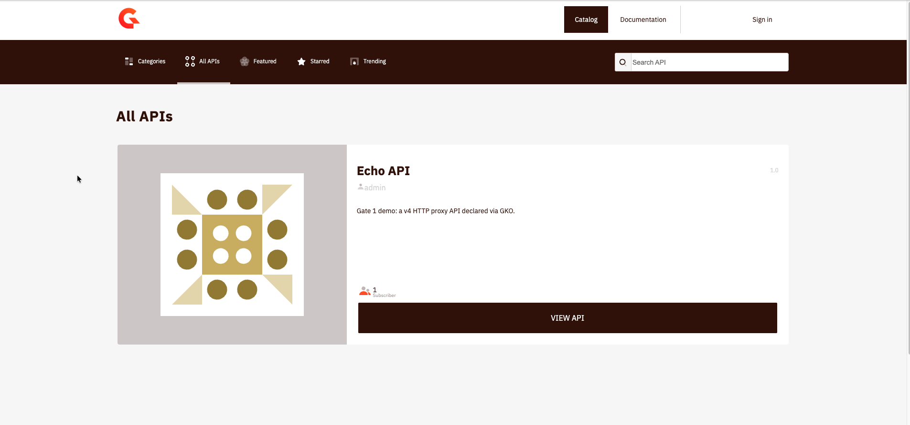
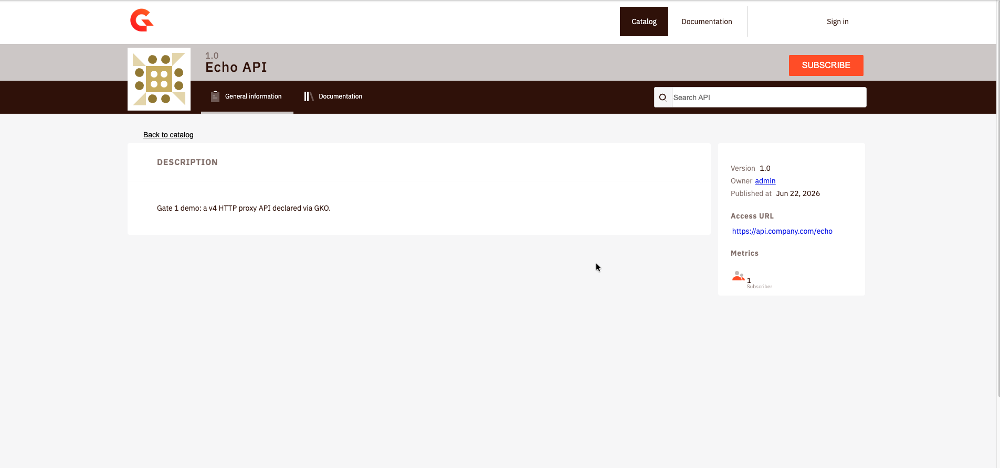
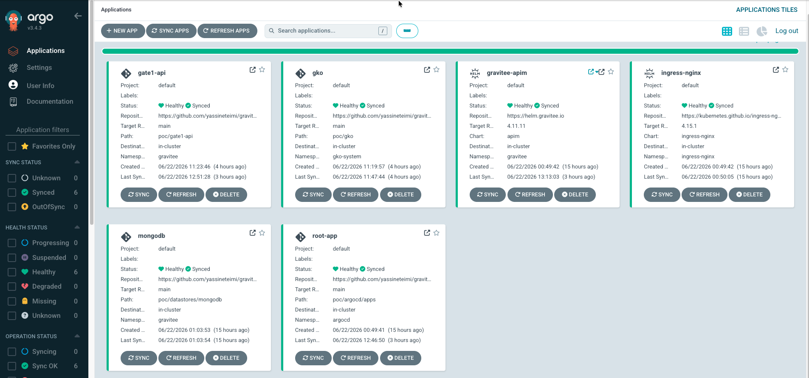

# Gate 1: API Gateway

The first gate publishes a real API on the gateway and puts identity and abuse
control in front of it: a Plan for authentication, a rate-limit policy, and a
self-service Developer Portal. Every part of it is declared as a Kubernetes
resource, reconciled by the **Gravitee Kubernetes Operator (GKO)** and ArgoCD,
so an API ships as a reviewed commit rather than a click in a UI.

## Why declare APIs with the operator

Gravitee offers four ways to define an API: the Console UI, the Management API
(scripted), the **Kubernetes Operator** (CRDs), and a Terraform provider. For a
GitOps-first PoC the operator is the natural fit: an `ApiV4Definition` is just
another manifest under the app-of-apps, reconciled like everything else, and
because GKO pushes the API into the Management API through a `ManagementContext`,
it still appears in the Console and Developer Portal. We get the git audit trail
and the visual surface at once.



## Installing the operator

GKO is added as one more ArgoCD application. One wrinkle is worth recording: the
operator ships as a Go **FIPS-140** build whose crypto intermittently corrupts
memory and panics on this arm64 node (Apple Silicon), first in the metrics
server's certificate generation, then on the webhook's TLS path. The symptom is a
nonsensical runtime panic:

```text title="GKO panic on arm64"
panic: runtime error: slice bounds out of range [:43673837399792] with capacity 32
	crypto/internal/fips140/bigmod/nat.go:100
```

The fix is to take the operator off the FIPS path with `GODEBUG=fips140=off`. The
Helm chart exposes no environment knob, so the operator is installed through a
small Kustomize overlay that inflates the chart and patches the variable in:

```yaml title="poc/gko/kustomization.yaml"
helmCharts:
  - name: gko
    repo: https://helm.gravitee.io
    version: 4.11.10
    releaseName: gko
    namespace: gko-system
    valuesFile: values.yaml
patches:
  - target:
      kind: Deployment
      name: gko-controller-manager
    patch: |-
      apiVersion: apps/v1
      kind: Deployment
      metadata:
        name: gko-controller-manager
      spec:
        template:
          spec:
            containers:
              - name: manager
                env:
                  - name: GODEBUG
                    value: fips140=off
```

!!! note "ArgoCD and Kustomize-with-Helm"
    Rendering this needs `kustomize build --enable-helm`, enabled once on ArgoCD
    via `kustomize.buildOptions: --enable-helm` in the `argocd-cm` ConfigMap. Two
    smaller gotchas followed: the repo-server's image had to move to
    `imagePullPolicy: IfNotPresent` (a flaky registry pull on a cached image),
    and the Helm values had to live in a `valuesFile` because `valuesInline` with
    nested maps trips a Kustomize marshaling bug.

## Connecting the operator to Gravitee

A `ManagementContext` tells GKO which control plane to push to. Credentials come
from a Secret injected from the gitignored `.env`, never committed:

```yaml title="poc/gate1-api/management-context.yaml"
apiVersion: gravitee.io/v1alpha1
kind: ManagementContext
metadata:
  name: apim-context
  namespace: gravitee
spec:
  # host:port only, no /management suffix (GKO appends it), and the qualified
  # service name because the operator runs in another namespace.
  baseUrl: http://gravitee-apim-api.gravitee:83
  environmentId: DEFAULT
  organizationId: DEFAULT
  auth:
    secretRef:
      name: gravitee-mgmt-context-auth
```

```{ .sh .terminal }
$ ./poc/scripts/inject-secrets.sh
$ kubectl get managementcontext apim-context -n gravitee \
    -o jsonpath='{.status.conditions[?(@.type=="Accepted")].message}'
```

```text title="Expected output"
Successfully reconciled
```

## The first API

A tiny in-cluster echo backend keeps the demo fully local. The API itself is an
`ApiV4Definition` proxying gateway path `/echo` to that backend. Three fields the
published quickstart omits are required by the operator, and without the
`flowExecution` block the validating webhook panics on a nil pointer:

```yaml title="poc/gate1-api/echo-api.yaml (excerpt)"
  endpointGroups:
    - name: default-group
      type: http-proxy
      endpoints:
        - name: echo-backend
          type: http-proxy
          inheritConfiguration: false   # required by GKO 4.11
          secondary: false              # required by GKO 4.11
          configuration:
            target: http://echo-server:80
  flowExecution:                        # absent => webhook nil-pointer panic
    mode: DEFAULT
    matchRequired: false
```

Once committed, ArgoCD applies it, GKO reconciles it into Gravitee, and it shows
up in the Console with a **Kubernetes Origin** badge that marks it as declared by
the operator rather than clicked in the UI:



The route works end to end, and the response carries Gravitee's transaction
headers, proof it passed through the gateway rather than hitting the backend
directly:

```{ .sh .terminal }
$ curl -s -o /dev/null -w "%{http_code}\n" \
    --resolve gateway.gravitee.local:80:127.0.0.1 http://gateway.gravitee.local/echo
```

```text title="Expected output"
200
```

## Securing it: an API-key plan and a rate limit

The keyless plan is swapped for an **API-key plan**, and an API-level flow adds a
**rate-limit policy** of five requests per ten seconds. Authentication runs
before the flow, so an unauthenticated call is rejected before it can consume
quota:

```yaml title="poc/gate1-api/echo-api.yaml (excerpt)"
  flows:
    - name: rate-limit
      enabled: true
      selectors:
        - type: HTTP
          path: "/"
          pathOperator: STARTS_WITH
      request:
        - name: Rate Limit
          enabled: true
          policy: rate-limit
          configuration:
            rate:
              limit: 5
              periodTime: 10
              periodTimeUnit: SECONDS
  plans:
    API_KEY:
      name: "API Key plan"
      status: PUBLISHED
      security:
        type: API_KEY
```

Both are visible in the Console, the plan and the rate-limit policy on the
request phase of the flow:



Enforcement, end to end: no key is rejected, a valid key passes until the limit,
then the gateway returns 429.

```{ .sh .terminal }
$ KEY=$(./poc/scripts/gate1-subscribe.sh | awk '/API key:/{print $3}')
$ curl -s -o /dev/null -w "no key:   %{http_code}\n" \
    --resolve gateway.gravitee.local:80:127.0.0.1 http://gateway.gravitee.local/echo
$ for i in $(seq 1 8); do
    curl -s -o /dev/null -w "call $i:   %{http_code}\n" -H "X-Gravitee-Api-Key: $KEY" \
      --resolve gateway.gravitee.local:80:127.0.0.1 http://gateway.gravitee.local/echo
  done
```

```text title="Expected output"
no key:   401
call 1:   200
call 2:   200
call 3:   200
call 4:   200
call 5:   200
call 6:   429
call 7:   429
call 8:   429
```

The gateway also advertises the limit on every allowed response:

```text title="Response headers within the window"
X-Rate-Limit-Limit: 5
X-Rate-Limit-Remaining: 4
X-Rate-Limit-Reset: 1782126240954
```

## The consumer and its key, without committing a secret

The consumer is a GKO-declared `Application`, so the API, its plan, and the
consumer are all code. The subscription is the one thing that is not: GKO's
`Subscription` resource only accepts an API-key plan if you embed the key in the
manifest, which would commit a credential to a public repo. API keys are runtime
secrets, so a small script mints one through the Management API and prints it; the
key is never persisted to git.

```{ .sh .terminal }
$ ./poc/scripts/gate1-subscribe.sh
```

```text title="Expected output"
Created subscription dbcd4825-51ec-4c97-8d48-2551ec7c9712

API key: 6a916794-1f07-455f-9167-941f07e55f95

Try it:
  curl -H "X-Gravitee-Api-Key: 6a916794-1f07-455f-9167-941f07e55f95" \
    --resolve gateway.gravitee.local:80:127.0.0.1 http://gateway.gravitee.local/echo
```

## Self-service: the Developer Portal

The API is published with public visibility, so it appears in the Developer
Portal catalog for any developer to discover:



From the API page a developer subscribes to the API-key plan and receives their
own key, the same flow the script automated, now self-service:



## Reconciled, end to end

Everything in this gate is an ArgoCD application reconciled from git: the
operator, the datastores, the gateway, and the Gate 1 resources, all Synced and
Healthy.



## What Gate 1 establishes

- A v4 proxy API, an authentication Plan, a rate-limit policy, and a Developer
  Portal, all declared as Kubernetes resources and reconciled by GKO and ArgoCD.
- Honest findings worth carrying forward: the operator needs `GODEBUG=fips140=off`
  on arm64; the published CRD quickstart is incomplete (`inheritConfiguration`,
  `secondary`, `flowExecution`); and API keys stay out of git as runtime secrets.

Next, **[Gate 2](ai-agent-gateway.md)** turns to AI and agent traffic, which
needs the Enterprise edition and starts the 14-day trial clock.
